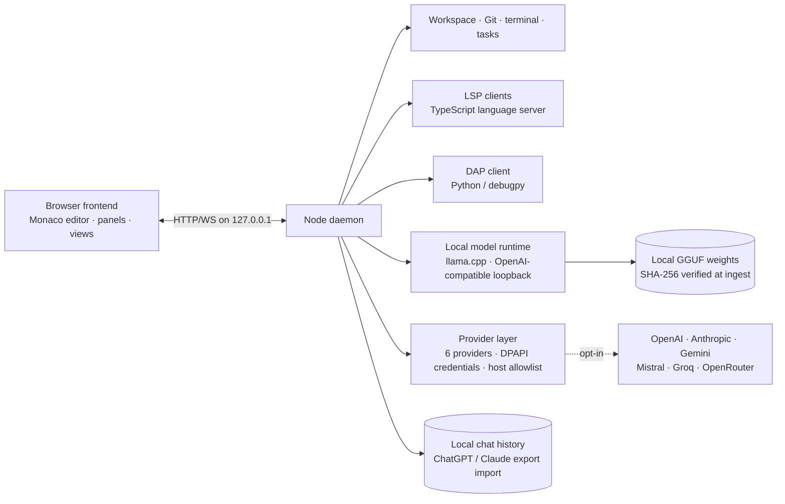

# AIDE Sovereign Workbench

AIDE is an open-source, offline-first development workbench for developers, researchers, and privacy-conscious teams who want a real code editor, local AI models, Git review, debugging, and optional online providers — without sending source code to the cloud.

Everything runs on your machine by default. Online providers are strictly opt-in.

[](https://github.com/AnonymousNomad/aide-sovereign-workbench/actions/workflows/ci.yml)
[](LICENSE)
[](https://github.com/AnonymousNomad/aide-sovereign-workbench/releases)
[](https://github.com/sponsors/anonymousnomad)

## Architecture

AIDE is a two-process workbench: a browser frontend (Monaco editor, panels, views) and a Node.js daemon (workspace, Git, processes, models). They talk over HTTP/WebSocket on the loopback interface only.



## What Works Today

Continuously verified against the real daemon and real browser: **188 architecture tests, 17 end-to-end browser tests, a 10/10 doctor preflight**, plus the unit batteries below (re-measured before every release; nothing here is claimed without a passing gate).

- **Cockpit orchestrator UI** — one workflow (Describe → Plan → Approve → Build → Verify): a chat/orchestrator dock, an approval-gated agent loop with per-call diff previews, live git-diff workbench, and a verification rail (diagnostics, git state, harness status). States, not modes: cold start is one button; every blocked state renders its own recovery action.
- **Model Hub (in-app acquisition)** — search Hugging Face GGUF repos, list quantizations with real file sizes, resumable downloads with progress and cancel, and one-click registration into the engine pool. Local `.gguf` import by path is supported for air-gapped setups.
- **Harness scaffold v2.1** — every chat gets a sized operating layer: a 3-line micro tier for small-context models, the full Code+Lens document (PART A non-overridable + influence-lens B1–B6) for strong budgets. Byte-deterministic composition, budget caps with honest drop reporting, and a fixed 20-task effectiveness battery (`scripts/run-harness-battery.mjs`) — results published in `docs/evidence/`, including the negative result that forced the redesign.
- **Backend auto-select** — candidate llama-server builds are probed via `--list-devices`; Vulkan/CUDA/CPU selection follows operator profile → cached benchmark verdict → hardware heuristic. On Pascal-class GPUs (e.g. GTX 1060) the measured generation advantage of the Vulkan backend over CPU is ~4.6× on bundled test models.
- **Editor** — workspace tree, tabs, dirty state, find/replace, split editor groups, session recovery.
- **Local AI models** — chat through an OpenAI-compatible loopback runtime; GGUF ingestion with SHA-256 verification and memory-fit checks against the local GPU/RAM. Weights are never bundled in the repository; they are downloaded separately and verified.
- **Model handoff** — every model that can chat is one route with its own context window; health-gated picker, history refit on switch, failed-route fallback with explicit notice, and every answer labeled with the model that produced it.
- **Language intelligence** — LSP client for TypeScript: diagnostics as editor markers, completion, hover, go-to-definition.
- **Debugging foundation** — DAP client for Python (debugpy): session tracking, breakpoints, stack/scope inspection. A full debuggee-fixture battery remains a release gate.
- **Git** — status, diff review, staging, commit, branches, history — all local, via the git CLI.
- **Terminal & tasks** — integrated terminal and a contract-first task service with problem matchers, compound task graphs, and streaming output events.
- **Online providers (opt-in)** — OpenAI, Anthropic, Google Gemini, Mistral, Groq, and OpenRouter. Credentials encrypted at rest with Windows DPAPI, never shown to the browser, scrubbed from logs; every host allowlisted.
- **Chat-history import** — ChatGPT and Claude `conversations.json` exports import additively into the local chat store.
- **Veritas evidence gates** — AI-generated changes must pass deterministic checks before release: compile, tests, Git whitespace, manifest validation, path boundaries, secret scanning. The harness never lets a model approve or apply its own changes.
- **Extras** — offline plugin manifests with trust/capability gates, Academy/tutor tracks, a Training Room for approved model runs, a local Community Hub, and reproducible workspace capsules.

Unit batteries behind this week's features (all green, re-runnable):
`tests/unit/test-facade.mjs` 12/12 · `tests/unit/test-scaffold-v2.mjs` 5/5 · `tests/unit/test-a1-agent.mjs` 14/14 · `tests/arch/agent-routes.test.ts` 5/5 · harness battery evidence in `docs/evidence/harness-battery-smollm2.md`.

### Honest limits

- Pre-production engineering release — **not** a claim of VS Code parity. See `docs/RELEASE_ROADMAP.md`.
- Desktop (Tauri/NSIS) packaging and installer smokes are defined in `desktop/README.md`; Rust compilation is a platform gate until a Rust toolchain is available.
- Live end-to-end provider calls require user-supplied credentials and are exercised manually per release — they are intentionally not part of the automated suite.
- The first live three-pack model scorecard (`benchmarks/live-results-2026-08-10.json`) shows all three models passing function and planning smoke tasks and failing strict unified-diff formatting — which is why every patch stays behind Veritas and human approval.

### Active work

Research-grounded, gated the same way as everything above:

- **Harness deepening** — mid-conversation core re-injection for long agent sessions, an L0–L4 layered composer preview route, and the full Code+Lens effectiveness battery rerun on strong-budget models (1.5B+ and operator fine-tunes).
- **Academy/tutor upgrades** — a persistent learner-mastery model with spaced-repetition review and real exercise execution.
- **Local training pipeline** — dataset studio, hardware-aware QLoRA runner with live loss streaming, and an eval-gated GGUF export loop so a fine-tuned model only registers if it beats its baseline.
- **BUILD series (tasks)** — notification harness and a local-only build cache (content-hash restore, zero cloud).

## Security & Privacy

- The daemon binds to the loopback interface only; no inbound port is exposed to the network.
- The browser bundle is local-only. `scripts/egress-audit.mjs` fails CI if a provider host or other external endpoint leaks into frontend code.
- Credentials live only in the daemon, encrypted at rest (Windows DPAPI, current user, non-interactive). Keys never appear in the browser, session state, or logs.
- Online providers are opt-in by default; a ChatGPT/Claude/Gemini subscription does **not** grant API access — a connection requires an API key from the provider console.
- Model-generated patches are never applied automatically; every change is reviewed as a diff and approved explicitly.
- See `SECURITY.md` for the security model and how to report vulnerabilities.

## Quickstart

Prerequisites: **Node.js 20+**. For local chat, install a matching `llama-server` binary and a `.gguf` weight file (see [Model Packs](#model-packs)).

```bash
npm install
npm run doctor
npm start
```

Open `http://127.0.0.1:4173/`. The first-run guide walks through model selection, runtime startup, chat, and the other views. `npm run doctor` reports missing binaries and model artifacts before you start.

## Tests

```bash
npm run check:arch   # TypeScript checks (node + browser), ESLint, then all architecture tests
npm run build:frontend
npm run test:e2e     # 17 Playwright browser tests against the real daemon
```

CI runs the same gate on ubuntu-latest and is green. Of the 188 architecture tests, 18 are environment-gated (they need bundled GGUF artifacts, a working Python + llama-cpp-python runtime, or a spawnable language server) and skip in CI with printed reasons; the remaining 170 execute for real. Locally with artifacts installed, all 188 run.

The contract layer (`common/contracts`, zod → OpenAPI) is shared by both sides, so frontend and daemon tests consume identical fixtures and drift is caught at check time.

## Model Packs

The public pack registers three optional Apache-2.0 models: SmolLM2 360M (fast chat/planning), Qwen2.5-Coder 0.5B (autocomplete), and Qwen2.5-Coder 1.5B (primary coding). See `models/PACKS.md`. Weights are never stored in the repository; run `npm run verify:model-bundle` before publishing a bundle. Unreleased project checkpoints are not exposed as IDE model packs.

## Reproducibility

- `harness/` — the model-independent closed loop (guard, retrieve, plan, propose, verify, revise, test, review, learn) and the Veritas evidence gates with calibrated thresholds.
- `capsules/` — portable offline workspace capsules: exact model, runtime, Git revision, evidence hashes, tools, and Veritas results, without exporting private source.
- `benchmarks/` — the common smoke suite for the public model packs; raw results are published, never fabricated.
- `docs/RESEARCH_LOG.md` — every architecture decision is recorded with its source.

## Contributing

See `CONTRIBUTING.md` for build/test commands, conventions, and the PR process. See `CODE_OF_CONDUCT.md` and `SUPPORT.md`.

## License

Apache-2.0 unless a file or dependency states otherwise (`LICENSE`). Third-party models retain their original licenses and attribution.

## Support

Sponsorship funds issue triage, releases, documentation, dependency updates, and long-term maintenance of the offline tooling and model evaluation work.