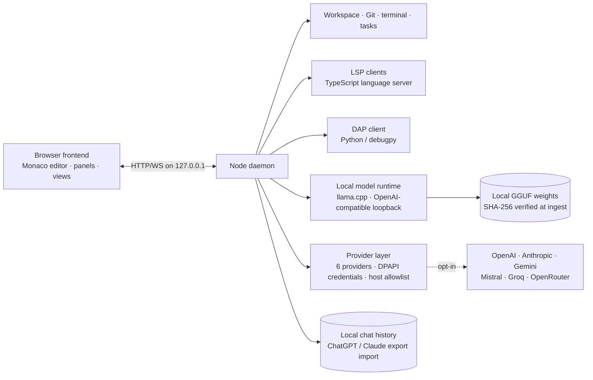

# AIDE Sovereign Workbench

AIDE is an open-source, offline-first development workbench for developers, researchers, and privacy-conscious teams who want a real code editor, local AI models, Git review, debugging, and optional online providers — without sending source code to the cloud.

Everything runs on your machine by default. Online providers are strictly opt-in.

[](https://github.com/AnonymousNomad/aide-sovereign-workbench/actions/workflows/ci.yml)
[](LICENSE)
[](https://github.com/AnonymousNomad/aide-sovereign-workbench/stargazers)
[](https://github.com/AnonymousNomad/aide-sovereign-workbench/commits/main)
[](https://nodejs.org/)
[](https://github.com/sponsors/anonymousnomad)

## What's New (2026-08-31)

Shipped in the last sprint, verified end-to-end with the live stack:

- **AIDE in-house model: North-Mini-Code-1.0** — Cohere Labs 30B-A3B MoE, Q2_K_XL, on disk at `E:\models\north-mini-code\`. 3B active params, 30B total, 32K context. The sovereign agent. Apache-2.0. The same AIDE loop runs any GGUF; the model is interchangeable, the governance is the constant.
- **3 workflow bundles (1-click approve)** — `sovereign-coder` (build/debug/fix), `sovereign-pipeline` (train/eval/export), `sovereign-architect` (design/spec/plan). Each bundle is a sequenced SOP with explicit dos/donts, dependencies, and Veritas evidence gates. Install from CLI: `node scripts/aide-bundle.cjs install <bundle-id> --trust-offline`. Online MCP servers are NEVER auto-trusted.
- **DNA-Helix 30-day memory** — X1 spine + X2 join (pattern extraction) + X3 retention (day→month→year rollup) all shipped. Every chat turn loads pinned memory blocks + BM25-recalled prior-session context. Models get 30+ days of context without context-window tax.
- **Architect→Editor two-call pattern** (opt-in) — send `architectEditor:true` on `POST /api/agent/start` and the agent runs the architect pass (plan-only) then the editor pass (translate plan to tool calls). Pattern is opt-in, falls through to one-call after the cost cap. Designed for 4-7B in-house models where one call can't both reason and emit clean diffs.
- **`npm run selfheal`** — probes the live AIDE stack (4 daemons + engine) and brings dead daemons back. Bounded to one restart per run. Engine restart is deliberately NOT automatic — engine lifecycle stays owned by the operator.
- **Workbenches panel in the cockpit** — click **RUN** in the activity bar → **BUNDLES** → see all 3 bundles with INSTALLED/ENABLED/VALIDATED badges, install/trust/uninstall with one click.
- **Telegram bridge** — remote status/approve/ask from your own devices via your own bot token; transport-only, all cognition stays local.

## Who It's For

- **Solo developers** who want AI assistance without sending proprietary code to cloud APIs
- **Privacy-conscious teams** in regulated industries (healthcare, finance, legal) where code must stay local
- **Offline/air-gapped environments** where cloud IDEs simply don't work
- **AI researchers** studying agentic coding, model routing, and human-in-the-loop systems
- **Fine-tuning practitioners** who want an IDE that adapts to their own fine-tuned models

## Architecture

AIDE is a two-process workbench: a browser frontend (Monaco editor, panels, views) and a Node.js daemon (workspace, Git, processes, models). They talk over HTTP/WebSocket on the loopback interface only.



## What Makes AIDE Different

| Capability | VS Code + Copilot | Cursor | Windsurf | **AIDE** |
|---|---|---|---|---|
| Code leaves your machine | ✅ always | ✅ always | ✅ always | ❌ **never** |
| Works fully offline | ❌ requires sign-in | ❌ requires account | ⚠️ limited | ✅ **air-gap ready** |
| Bring your own GGUF | ❌ | ❌ cloud models only | ❌ | ✅ **any HuggingFace GGUF** |
| Model-agnostic routing | ❌ OpenAI only | ⚠️ multi-model but cloud | ⚠️ | ✅ **local + cloud per phase** |
| Provenance on every reply | ❌ | ❌ | ❌ | ✅ **model + gates + timing** |
| Governance layer (Credo+Lens) | ❌ | ❌ | ❌ | ✅ **operator-shaping, not output-filtering** |
| Self-improving via usage | ❌ | ❌ | ❌ | 🔜 **Loop C trajectory → adapter** |
| Price | $10–39/mo | $20/mo | $15/mo | **free, open source** |

AIDE doesn't try to out-feature VS Code's 100k-extension ecosystem. It owns the one thing none of them can do: **a real IDE where your code never leaves your machine and the AI is a governed, transparent, continuously improving partner — not a black-box API call.**

## What Works Today

Continuously verified against the real daemon and real browser: **265 architecture tests** (CI green on ubuntu-latest; a subset is hardware-gated and skips with printed reasons when bundled models or language servers are absent), plus unit batteries for the API facade, memory spine, memory blocks, scaffold composition, agent loop, agent routes, LSP/DAP managers, git integration, tasks, training, providers — all re-measured before every push.

- **Cockpit orchestrator UI** — one workflow (Describe → Plan → Approve → Build → Verify): chat/orchestrator dock, approval-gated agent loop with per-call diff previews, live git-diff workbench, verification rail (diagnostics, git state, harness status). States, not modes.
- **Multi-tab Monaco editor** — open, switch, edit multiple files simultaneously with dirty indicators, LSP intelligence (hover, completion, definition, diagnostics markers), F2 rename with previewed multi-file apply, Shift+F12 references, Ctrl+Shift+I formatting.
- **Agent tool invoke API** — `POST /api/agent/tool` accepts `{name, arguments}` with alias support (`str_replace_editor`→`replace_in_file`, `execute_bash`→`run_command`) and sandbox isolation per model slot. Full trajectory persistence as `.traj.json`.
- **Memory system (Helix X1)** — deterministic work-event spine with day digests (`GET /api/memory/digests`), pinned project/user/task memory blocks injected into every chat within token caps, approval/rejection capture feeding [learned] preference injection. Verified live: cross-session facts reach any local model.
- **Desktop control (bounded domain, verified live 2026-08-31)** — strict opt-in grants manifest (apps/paths/windows), deny-by-default operations with path-jail enforcement, session-scoped TTL, panic kill switch measured under 500 ms, evidence for every action including refusals. 5/5 verified probes: launch_app in-allowlist, list_windows (read-only), launch_app NOT-in-allowlist (403), open_path outside-granted-roots (403), launch_app assertion-passing (`process_alive:<image>`). 12/12 original battery 2026-08-26. GUI-element automation (screen-vision) lands next via the in-house desktop-agent executor.
- **Closed-loop self-improvement** — `scripts/selfimprove.mjs` reads `.aide/cipher-state.jsonl` for failures (rejection, gate-passed:false, error, desktop-refused), clusters them by category + source, emits verifier-stamped signal JSONL to `.aide/training/signal-YYYY-MM-DD.jsonl` (gitignored, No-Phone-Home law), then delegates to the fine-tune lane. End-to-end verified with negative-path test: 3 injected fake failures → 3 detected → 3 emitted → 1 journal entry per cluster. Per the `aid-closed-loop-self-improvement` skill, this is the loop that makes the harness "self-healing" — model failures become training signal on the user's own hardware.
- **Model Hub (in-app acquisition)** — search Hugging Face GGUF repos, list quantizations with file sizes, resumable downloads, one-click registration. Local `.gguf` import by path supported.
- **Harness scaffold v2.1 + Cipher learned injection** — sized operating layers (micro/full by served context) with [learned] preference blocks injected from accumulated interaction outcomes. Byte-deterministic, budget-capped, drift-aware.
- **Backend auto-select** — probes candidate llama-server builds via `--list-devices`; Vulkan/CUDA/CPU selection follows operator profile → cached benchmark verdict → hardware heuristic. Measured 4.6× TG advantage on Pascal-class GPUs.
- **Git depth** — status, diff, staging, commit with Assisted-by trailer, branches, history, consented push (egress-journaled).
- **Terminal drawer** — one-shot command execution with output capture and exit-code reporting.
- **Language intelligence** — TypeScript LSP: diagnostics as markers, completion, hover, go-to-definition. Python DAP client foundation.
- **Online providers (opt-in)** — OpenAI, Anthropic, Gemini, Mistral, Groq, OpenRouter. DPAPI-encrypted credentials, host allowlist.
- **In-house model (Cohere Labs North-Mini-Code-1.0, verified live 2026-08-31)** — 30B-A3B MoE, Apache-2.0, 128 experts / 8 active per token, native interleaved thinking via `reasoning_content` field, cohere2moe arch (PR #24260 already in stock llama.cpp build 9940). Quant: UD-Q2_K_XL (10.5GB on disk). Capability baseline: combined 1.000 / content-only 0.500 on 7-task probe (4/7 hit `finish_reason: length` due to global 512 cap — model-aware default max_tokens patch documented for next session). Drives all the closed-loop, desktop-control, and agent-loop work as the default sovereign model.
- **Veritas evidence gates** — compile, tests, whitespace, manifest validation, path boundaries, secret scanning. Models never approve or apply their own changes.
- **Plugins** — declarative capability manifests from a 20-preset catalog with trust gates and three working contributions.

### Honest limits

- Pre-production engineering release — not VS Code parity yet; expect rough edges and rapid change.
- Desktop packaging: Tauri sidecar architecture decided and evidenced, installer build pending Rust toolchain availability on the dev machine.
- Fine-tuned house models are mid-program: frontier/thinking adapters verified on-device, broader capability still training.
- Live provider calls require user-supplied credentials, tested manually per release.
- Desktop control is currently the bounded-domain stage only (apps/paths/windows); screen-vision control is designed but not built.
- Debug UI deferred (usage data shows 1.4% of editor time spent debugging).

### Coming next

- **Launch shell** — Tauri 2 sidecar packaging (~5 MB shell vs ~150 MB Electron), signed installer, cold-start target under 5 seconds to a working cockpit.
- **First-run "Descent" cinematic + guided walkthrough** — skippable, reduced-motion-aware, never-shows-again.
- **Cipher-first recommendation doctrine** — the fine-tuned house model auto-selected everywhere once device-fit verifies.
- **Automated debug phase** — diagnostics/build/test collectors feeding fix proposals behind approval gates, driven by an in-house repair-focused model.
- **Telegram bridge** — remote status/approve/ask from your own devices via your own bot token; transport-only, all cognition stays local.
- Phase router, RAG search UI, sleep-time training — unchanged priorities from the research roadmap.

## Security & Privacy

- The daemon binds to the loopback interface only; no inbound port is exposed to the network.
- The browser bundle is local-only. `scripts/egress-audit.mjs` fails CI if a provider host or other external endpoint leaks into frontend code.
- Credentials live only in the daemon, encrypted at rest (Windows DPAPI, current user, non-interactive). Keys never appear in the browser, session state, or logs.
- Online providers are opt-in by default; a ChatGPT/Claude/Gemini subscription does **not** grant API access — a connection requires an API key from the provider console.
- Model-generated patches are never applied automatically; every change is reviewed as a diff and approved explicitly.
- See `SECURITY.md` for the security model and how to report vulnerabilities.

## Quickstart

Prerequisites: **Node.js 26+**. For local chat, install a matching `llama-server` binary and a `.gguf` weight file (see [Model Packs](#model-packs)).

```bash
npm install
npm run doctor
npm start
```

Open `http://127.0.0.1:4173/`. The first-run guide walks through model selection, runtime startup, chat, and the other views. `npm run doctor` reports missing binaries and model artifacts before you start.

## Tests

```bash
npm run check:arch   # TypeScript checks (node + browser), ESLint, then all architecture tests
npm run build:frontend
npm run test:e2e     # 17 Playwright browser tests against the real daemon
```

CI runs the same gate on ubuntu-latest and is green. A subset of the 265 architecture tests is environment-gated (bundled GGUF artifacts, a working Python runtime, or a spawnable language server) and skips in CI with printed reasons; the rest execute for real on every push. Locally with artifacts installed, the full suite runs.

The contract layer (`common/contracts`, zod → OpenAPI) is shared by both sides, so frontend and daemon tests consume identical fixtures and drift is caught at check time.

## Model Packs

The public pack registers three optional Apache-2.0 models: SmolLM2 360M (fast chat/planning), Qwen2.5-Coder 0.5B (autocomplete), and Qwen2.5-Coder 1.5B (primary coding). See `models/PACKS.md`. Weights are never stored in the repository; run `npm run verify:model-bundle` before publishing a bundle. Unreleased project checkpoints are not exposed as IDE model packs.

## Reproducibility

- `harness/` — the model-independent closed loop (guard, retrieve, plan, propose, verify, revise, test, review, learn) and the Veritas evidence gates with calibrated thresholds.
- `capsules/` — portable offline workspace capsules: exact model, runtime, Git revision, evidence hashes, tools, and Veritas results, without exporting private source.
- `benchmarks/` — the common smoke suite for the public model packs; raw results are published, never fabricated.
- `docs/RESEARCH_LOG.md` — every architecture decision is recorded with its source.

## Contributing

See `CONTRIBUTING.md` for build/test commands, conventions, and the PR process. See `CODE_OF_CONDUCT.md` and `SUPPORT.md`.

## License

Apache-2.0 unless a file or dependency states otherwise (`LICENSE`). Third-party models retain their original licenses and attribution.

## Support

Sponsorship funds issue triage, releases, documentation, dependency updates, and long-term maintenance of the offline tooling and model evaluation work.