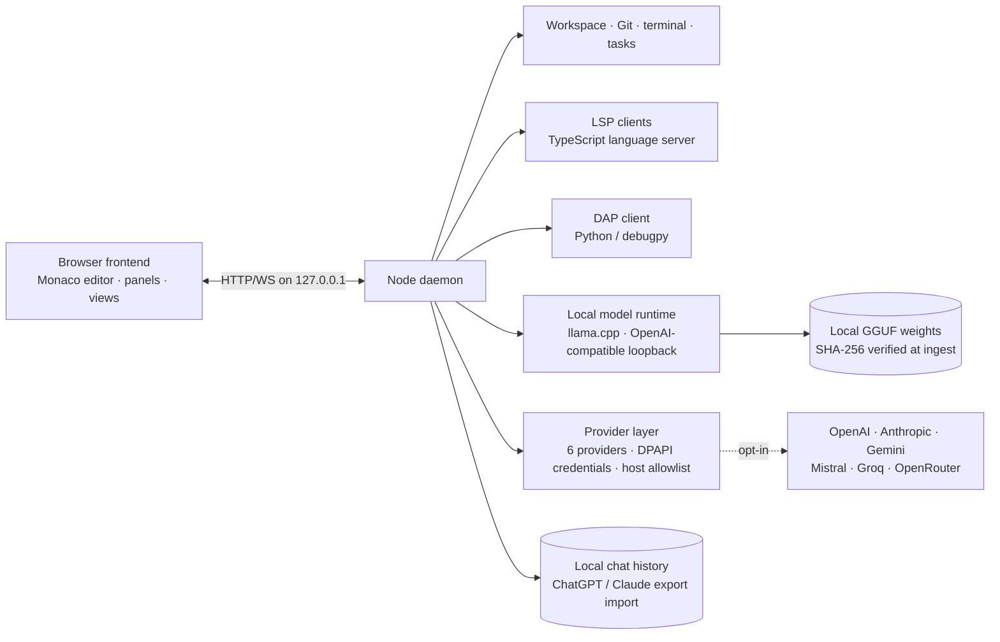

# AIDE Sovereign Workbench

AIDE is an open-source, offline-first development workbench for developers, researchers, and privacy-conscious teams who want a real code editor, local AI models, Git review, debugging, and optional online providers — without sending source code to the cloud.

Everything runs on your machine by default. Online providers are strictly opt-in.

[](https://github.com/AnonymousNomad/aide-sovereign-workbench/actions/workflows/ci.yml)
[](LICENSE)
[](https://github.com/AnonymousNomad/aide-sovereign-workbench/stargazers)
[](https://github.com/AnonymousNomad/aide-sovereign-workbench/network/members)
[](https://github.com/AnonymousNomad/aide-sovereign-workbench/issues)
[](https://github.com/AnonymousNomad/aide-sovereign-workbench/blob/main/CONTRIBUTING.md)
[](https://github.com/AnonymousNomad/aide-sovereign-workbench/commits/main)
[](https://www.typescriptlang.org/)
[](https://nodejs.org/)
[](https://github.com/AnonymousNomad/aide-sovereign-workbench)
[](https://github.com/sponsors/anonymousnomad)

## Who It's For

- **Solo developers** who want AI assistance without sending proprietary code to cloud APIs
- **Privacy-conscious teams** in regulated industries (healthcare, finance, legal) where code must stay local
- **Offline/air-gapped environments** where cloud IDEs simply don't work
- **AI researchers** studying agentic coding, model routing, and human-in-the-loop systems
- **Fine-tuning practitioners** who want an IDE that adapts to their own fine-tuned models

## Architecture

AIDE is a two-process workbench: a browser frontend (Monaco editor, panels, views) and a Node.js daemon (workspace, Git, processes, models). They talk over HTTP/WebSocket on the loopback interface only.



## What Makes AIDE Different

| Capability | VS Code + Copilot | Cursor | Windsurf | **AIDE** |
|---|---|---|---|---|
| Code leaves your machine | ✅ always | ✅ always | ✅ always | ❌ **never** |
| Works fully offline | ❌ requires sign-in | ❌ requires account | ⚠️ limited | ✅ **air-gap ready** |
| Bring your own GGUF | ❌ | ❌ cloud models only | ❌ | ✅ **any HuggingFace GGUF** |
| Model-agnostic routing | ❌ OpenAI only | ⚠️ multi-model but cloud | ⚠️ | ✅ **local + cloud per phase** |
| Provenance on every reply | ❌ | ❌ | ❌ | ✅ **model + gates + timing** |
| Governance layer (Credo+Lens) | ❌ | ❌ | ❌ | ✅ **operator-shaping, not output-filtering** |
| Self-improving via usage | ❌ | ❌ | ❌ | 🔜 **Loop C trajectory → adapter** |
| Price | $10–39/mo | $20/mo | $15/mo | **free, open source** |

AIDE doesn't try to out-feature VS Code's 100k-extension ecosystem. It owns the one thing none of them can do: **a real IDE where your code never leaves your machine and the AI is a governed, transparent, continuously improving partner — not a black-box API call.**

## What Works Today

Continuously verified against the real daemon and real browser: **188 architecture tests, 17 end-to-end browser tests, a 10/10 doctor preflight**, plus unit batteries for facade (12/12), scaffold composition (5/5), agent loop (14/14), agent routes (5/5), and LSP manager — all re-measured before every push.

- **Cockpit orchestrator UI** — one workflow (Describe → Plan → Approve → Build → Verify): chat/orchestrator dock, approval-gated agent loop with per-call diff previews, live git-diff workbench, verification rail (diagnostics, git state, harness status). States, not modes.
- **Multi-tab Monaco editor** — open, switch, edit multiple files simultaneously with dirty indicators, LSP intelligence (hover, completion, definition, diagnostics markers), F2 rename with previewed multi-file apply, Shift+F12 references, Ctrl+Shift+I formatting.
- **Agent tool invoke API** — `POST /api/agent/tool` accepts `{name, arguments}` with alias support (`str_replace_editor`→`replace_in_file`, `execute_bash`→`run_command`) and sandbox isolation per model slot. Full trajectory persistence as `.traj.json`.
- **Model Hub (in-app acquisition)** — search Hugging Face GGUF repos, list quantizations with file sizes, resumable downloads, one-click registration. Local `.gguf` import by path supported.
- **Harness scaffold v2.1 + Cipher learned injection** — sized operating layers (micro/full by served context) with [learned] preference blocks injected from accumulated interaction outcomes. Byte-deterministic, budget-capped, drift-aware.
- **Backend auto-select** — probes candidate llama-server builds via `--list-devices`; Vulkan/CUDA/CPU selection follows operator profile → cached benchmark verdict → hardware heuristic. Measured 4.6× TG advantage on Pascal-class GPUs.
- **Git depth** — status, diff, staging, commit with Assisted-by trailer, branches, history, consented push (egress-journaled).
- **Terminal drawer** — one-shot command execution with output capture and exit-code reporting.
- **Language intelligence** — TypeScript LSP: diagnostics as markers, completion, hover, go-to-definition. Python DAP client foundation.
- **Online providers (opt-in)** — OpenAI, Anthropic, Gemini, Mistral, Groq, OpenRouter. DPAPI-encrypted credentials, host allowlist.
- **Veritas evidence gates** — compile, tests, whitespace, manifest validation, path boundaries, secret scanning. Models never approve or apply their own changes.
- **Plugins** — declarative capability manifests from a 20-preset catalog with trust gates and three working contributions.
- **Extras** — offline plugin manifests, Academy/tutor tracks, Training Room, Community Hub, workspace capsules, 139 in-box SOP packs.

### Honest limits

- Pre-production engineering release — not VS Code parity yet.
- Desktop packaging (Tauri/Electron) defined but blocked on Rust toolchain availability.
- Fine-tuned model quality depends on training data quality; garbled output from insufficient fine-tuning is a known issue being addressed.
- Live provider calls require user-supplied credentials, tested manually per release.
- Debug UI deferred (usage data shows 1.4% of editor time spent debugging).

### Coming next

- Phase router: automatic model assignment per build phase (PLAN→CODE→TEST→REVIEW)
- Multi-lens review: security/performance/maintainability passes on every change
- RAG search UI: semantic code search across workspace
- Installer: Tauri or Electron packaging for one-click install
- Sleep-time training: nightly QLoRA on accumulated verified trajectories

Unit batteries behind this week's features (all green, re-runnable):
`tests/unit/test-facade.mjs` 12/12 · `tests/unit/test-scaffold-v2.mjs` 5/5 · `tests/unit/test-a1-agent.mjs` 14/14 · `tests/arch/agent-routes.test.ts` 5/5 · harness battery evidence in `docs/evidence/harness-battery-smollm2.md`.

### Honest limits

- Pre-production engineering release — **not** a claim of VS Code parity. See `docs/RELEASE_ROADMAP.md`.
- Desktop (Tauri/NSIS) packaging and installer smokes are defined in `desktop/README.md`; Rust compilation is a platform gate until a Rust toolchain is available.
- Live end-to-end provider calls require user-supplied credentials and are exercised manually per release — they are intentionally not part of the automated suite.
- The first live three-pack model scorecard (`benchmarks/live-results-2026-08-10.json`) shows all three models passing function and planning smoke tasks and failing strict unified-diff formatting — which is why every patch stays behind Veritas and human approval.

### Active work

Research-grounded, gated the same way as everything above:

- **Harness deepening** — mid-conversation core re-injection for long agent sessions, an L0–L4 layered composer preview route, and the full Code+Lens effectiveness battery rerun on strong-budget models (1.5B+ and operator fine-tunes).
- **Academy/tutor upgrades** — a persistent learner-mastery model with spaced-repetition review and real exercise execution.
- **Local training pipeline** — dataset studio, hardware-aware QLoRA runner with live loss streaming, and an eval-gated GGUF export loop so a fine-tuned model only registers if it beats its baseline.
- **BUILD series (tasks)** — notification harness and a local-only build cache (content-hash restore, zero cloud).

## Security & Privacy

- The daemon binds to the loopback interface only; no inbound port is exposed to the network.
- The browser bundle is local-only. `scripts/egress-audit.mjs` fails CI if a provider host or other external endpoint leaks into frontend code.
- Credentials live only in the daemon, encrypted at rest (Windows DPAPI, current user, non-interactive). Keys never appear in the browser, session state, or logs.
- Online providers are opt-in by default; a ChatGPT/Claude/Gemini subscription does **not** grant API access — a connection requires an API key from the provider console.
- Model-generated patches are never applied automatically; every change is reviewed as a diff and approved explicitly.
- See `SECURITY.md` for the security model and how to report vulnerabilities.

## Quickstart

Prerequisites: **Node.js 20+**. For local chat, install a matching `llama-server` binary and a `.gguf` weight file (see [Model Packs](#model-packs)).

```bash
npm install
npm run doctor
npm start
```

Open `http://127.0.0.1:4173/`. The first-run guide walks through model selection, runtime startup, chat, and the other views. `npm run doctor` reports missing binaries and model artifacts before you start.

## Tests

```bash
npm run check:arch   # TypeScript checks (node + browser), ESLint, then all architecture tests
npm run build:frontend
npm run test:e2e     # 17 Playwright browser tests against the real daemon
```

CI runs the same gate on ubuntu-latest and is green. Of the 188 architecture tests, 18 are environment-gated (they need bundled GGUF artifacts, a working Python + llama-cpp-python runtime, or a spawnable language server) and skip in CI with printed reasons; the remaining 170 execute for real. Locally with artifacts installed, all 188 run.

The contract layer (`common/contracts`, zod → OpenAPI) is shared by both sides, so frontend and daemon tests consume identical fixtures and drift is caught at check time.

## Model Packs

The public pack registers three optional Apache-2.0 models: SmolLM2 360M (fast chat/planning), Qwen2.5-Coder 0.5B (autocomplete), and Qwen2.5-Coder 1.5B (primary coding). See `models/PACKS.md`. Weights are never stored in the repository; run `npm run verify:model-bundle` before publishing a bundle. Unreleased project checkpoints are not exposed as IDE model packs.

## Reproducibility

- `harness/` — the model-independent closed loop (guard, retrieve, plan, propose, verify, revise, test, review, learn) and the Veritas evidence gates with calibrated thresholds.
- `capsules/` — portable offline workspace capsules: exact model, runtime, Git revision, evidence hashes, tools, and Veritas results, without exporting private source.
- `benchmarks/` — the common smoke suite for the public model packs; raw results are published, never fabricated.
- `docs/RESEARCH_LOG.md` — every architecture decision is recorded with its source.

## Contributing

See `CONTRIBUTING.md` for build/test commands, conventions, and the PR process. See `CODE_OF_CONDUCT.md` and `SUPPORT.md`.

## License

Apache-2.0 unless a file or dependency states otherwise (`LICENSE`). Third-party models retain their original licenses and attribution.

## Support

Sponsorship funds issue triage, releases, documentation, dependency updates, and long-term maintenance of the offline tooling and model evaluation work.